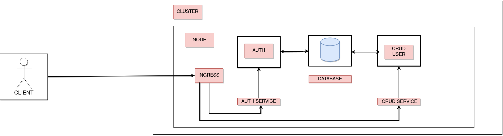
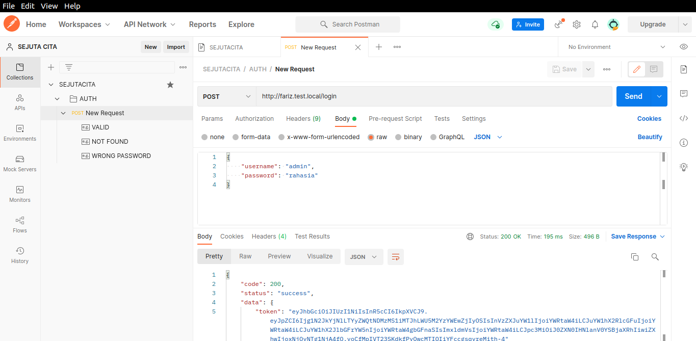
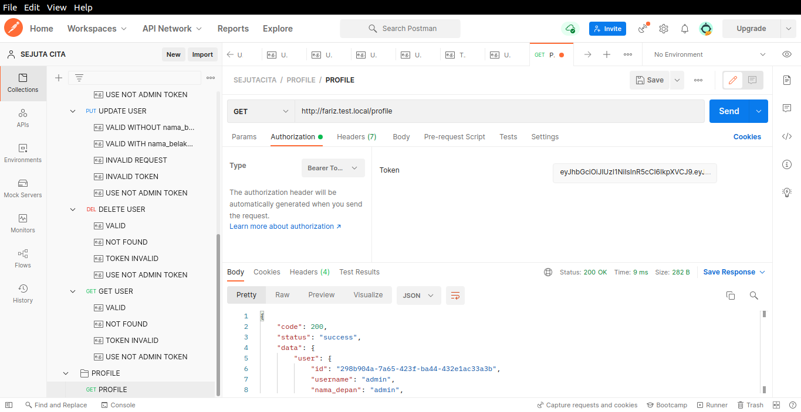

# MICROSERVICE CRUD USER + DEPLOY KUBERNETES

- Flow

- File Config Kubernetes: ingress.yaml

- Credential Default
  - Admin
    - Username: admin
    - Password: rahasia
  - User
    - Username: user
    - Password: rahasia

- Dokumentasi
  - [Sudah Publish](https://documenter.getpostman.com/view/19223557/UVXnHa9r), link ini berisi dokumentasi Collection yang telah dipublish
  - SEJUTACITA.postman_collection.json, file ini ada di root folder project ini, import file ini ke postman untuk menggunakan
    

**Note: Untuk Melakukan Operasi Delete,Update,Get User Harap Tambahkan User Terlebih Dahulu, Karena Program Ini Hanya Menyediakan 2 Data Default Yaitu Admin dan User**

- Screenshot Deploy Kubernetes Local

  - Login
  

  - Get Users
  

  - Post User
  

  - Delete User
  

  - Update User
  

  - Get User
  

  - Profile
  